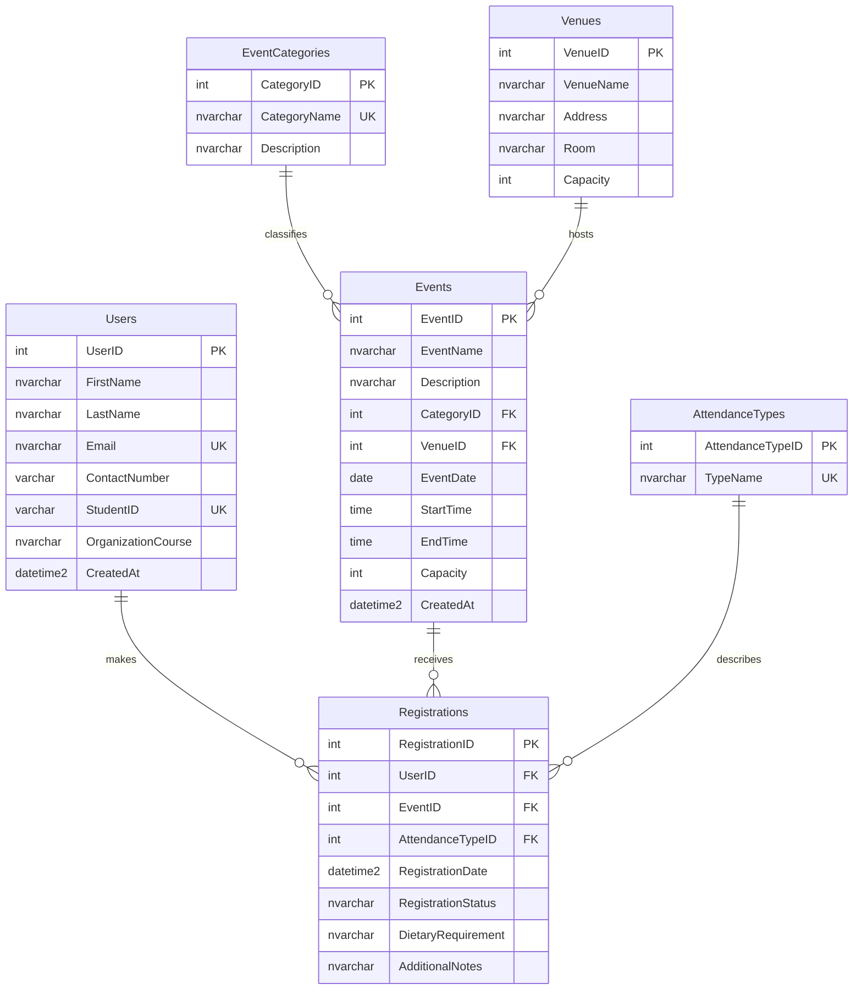

# SUBMISSION.md — Online Campus Event Management System

## Team Roster

| Member | Name | Assigned Role | Core Responsibilities |
|---|---|---|---|
| Member 1 | John Cyrel S Nazareno | Systems Architect & Prompt Lead | Task 1, and half of Task 4 |
| Member 2 | Marwan T Bawayan | Frontend Engineer | Task 2 |
| Member 3 | Carl Timtiman | Database & Backend Engineer | Task 3 and half of Task 4 |

The group has three members, so Members 1 and 3 share Task 4 (QA & Security) as stated in the exam instructions.

---

## Task 1: Requirements Analysis & Prompt Architecture

### 1.1 Exact Prompt Used (RCTC Framework)

```text
ROLE
You are a Lead Systems Architect with 15 years of experience designing web
systems for universities. You specialize in scoping small, realistic
prototypes that a student team can finish on time.

CONTEXT
A group of 3-4 fourth-year BSIT students has exactly 3 hours to build a
working prototype of an Online Campus Event Management System. The system
must let students view upcoming campus events and register for an event, and
let administrators view the list of registered attendees. The team is
beginner-level with generative AI tools. The prototype will use: HTML5/CSS/
vanilla JavaScript for the frontend, C# (ASP.NET Core Web API) for the
backend, and SQL Server for the database. Team roles are: Systems Architect,
Frontend Engineer, Database/Backend Engineer, and QA/Security Engineer.

TASK
Produce an overall system design that includes:
1. Functional requirements (by user type) and non-functional requirements.
2. A high-level architecture (layers/components and how they communicate).
3. The recommended tech stack with a one-line justification for each choice.
4. The main database entities and their relationships (overview only).
5. A list of REST API endpoints (method, path, purpose).
6. A recommended repository folder structure.
7. A 180-minute implementation timeline split across the four roles.
8. The top 3 risks and how to mitigate them.

CONSTRAINTS
- Do NOT use third-party state management libraries such as Redux.
- Do NOT propose microservices, Docker, Kubernetes, or any cloud deployment.
- Do NOT use paid services or tools that require long setup or accounts.
- Do NOT suggest heavy frontend frameworks (Angular, React, Vue); use
  vanilla JavaScript only.
- Use Semantic HTML5 and WCAG-friendly practices in the frontend design.
- All database access must use parameterized queries; the schema must be 3NF.
- Keep the scope to a minimal viable prototype that is achievable in 3 hours.
- Format the response in Markdown with headings and tables; max 700 words.
```

### 1.2 AI Output

> **Tool used:** Claude (Anthropic). Output below is recorded as generated.

#### Online Campus Event Management System — System Design

##### 1. Requirements

**Functional**

| User | Requirement |
|---|---|
| Student | View list of upcoming events (title, date, venue, available seats) |
| Student | Register for an event using name + school email |
| Student | See confirmation or error (full event, duplicate registration, invalid email) |
| Admin | View the list of registered attendees per event |

**Non-functional**
- Accessible (WCAG/POUR), semantic HTML5
- Secure: parameterized queries, input validation, no hard-coded secrets in final code
- Simple to run locally in under 5 minutes
- Responsive layout (mobile + desktop)

##### 2. High-Level Architecture

A simple **3-tier monolith**:

```
Browser (HTML/CSS/JS)  -->  ASP.NET Core Web API  -->  SQL Server
   Presentation              Business + Data Access        Persistence
```

- **Presentation:** static pages using `fetch()` to call the API. UI state is kept in plain JS variables/DOM — no state library.
- **API layer:** Controllers → `RegistrationService` (validation + business rules) → data access with `SqlCommand` parameters.
- **Database:** single SQL Server database, 3NF schema.

##### 3. Tech Stack

| Layer | Choice | Justification |
|---|---|---|
| Frontend | HTML5, CSS3, vanilla JS | No build step; easy to make accessible |
| Backend | ASP.NET Core Web API (C#) | Matches the team's C# security/testing tasks |
| Database | SQL Server (LocalDB/Express) | Supports FKs, CHECK constraints, non-clustered indexes |
| Testing | xUnit + Moq | Mock DB dependencies for validation unit tests |
| Version control | GitHub | Required deliverable |

##### 4. Core Entities (overview)

- **Users** (UserId, FullName, Email, Role)
- **Events** (EventId, Title, Description, EventDate, Venue, Capacity)
- **Registrations** (RegistrationId, UserId → Users, EventId → Events, RegisteredAt)

Relationships: one User → many Registrations; one Event → many Registrations. A unique constraint on (UserId, EventId) prevents duplicates.

##### 5. API Endpoints

| Method | Path | Purpose |
|---|---|---|
| GET | `/api/events` | List upcoming events with seats left |
| GET | `/api/events/{id}` | Event details |
| POST | `/api/registrations` | Register a student for an event |
| GET | `/api/admin/events/{id}/attendees` | Admin: list attendees for an event |

##### 6. Repository Structure

```
/frontend        index.html, styles.css, app.js
/backend         Controllers/, Services/RegistrationService.cs
/backend.tests   RegistrationValidatorTests.cs
/database        schema.sql
SUBMISSION.md
README.md
```

##### 7. 180-Minute Timeline

| Minutes | Architect | Frontend | Database/Backend | QA/Security |
|---|---|---|---|---|
| 0–30 | Task 1 prompt + design | Wireframe, set up `/frontend` | Draft entities | Review requirements |
| 30–75 | Review outputs | Build catalog + form | 3NF schema, ERD | Write unit tests (mocks) |
| 75–120 | Integrate API contract | Connect `fetch()` to API | DDL + indexes + API | Diagnose flawed code |
| 120–165 | Merge branches | Accessibility pass | Seed test data | Refactor to parameterized + `using` |
| 165–180 | Finish SUBMISSION.md, verification log | — | — | — |

##### 8. Top Risks

| Risk | Mitigation |
|---|---|
| Scope creep (login, payments, emails) | Skip authentication; use a simple admin page for the prototype |
| Merge conflicts in one repo | One folder per member; use branches and small commits |
| AI output has bugs/security flaws | Peer review every AI output; log fixes in the Verification Table |

### 1.3 Manual Grounding Evaluation

The AI-generated architecture is realistic for a 3-hour prototype because it uses a simple three-tier monolith with only three database tables and four API endpoints, avoiding heavy infrastructure such as microservices or cloud hosting. The technology stack (vanilla JS, ASP.NET Core, SQL Server) matches the tasks in this exam, including the C# security refactoring and SQL schema work. The timeline is slightly optimistic, since integrating the frontend with the API and setting up a local SQL Server could take longer than planned, so we reduce risk by skipping authentication and using seeded test data. The design also assumed a four-person team with a separate QA role and used file names that differ from the exam's required paths, so we adjusted both (see the Verification Log). Overall, the scope is achievable if each member works within their own folder and the team keeps to the minimal features.

---

## Task 2: AI-Assisted Frontend Development

**Lead:** Member 2 (Frontend Engineer) · **Tool used:** v0 by Vercel · **Location:** `/frontend`

### 2.1 Prompt Summary

Claude was prompted as a professional frontend engineer and UI/UX designer to build an Event Catalog & Registration Form prototype in HTML5, CSS3 and vanilla JavaScript with no backend. The prompt required semantic HTML5 (`<header>`, `<main>`, `<section>`, `<article>`, `<footer>`), at least six sample events, search and category/date filtering, a full registration form with client-side validation, an accessible confirmation panel, a responsive layout, and basic WCAG/POUR accessibility.

### 2.2 Output (jc paupdate thanks)

| File | Purpose |
|---|---|
| `frontend/index.html` | Semantic page structure: header and navigation, hero, filter section, event catalog, registration form, footer, confirmation dialog |
| `frontend/style.css` | Design tokens, responsive Grid/Flexbox layout, button states, visible focus styles |
| `frontend/script.js` | Event data, search and filtering, event selection, form validation, confirmation |
| `frontend/images/` | Six local SVG event illustrations |

### 2.3 Requirement Coverage

| Requirement | How it is met |
|---|---|
| Semantic HTML5 | `header`, `nav`, `main`, `section`, `article` (one per event card), `footer`, `form`, `fieldset`/`legend`, `dialog`; `div` is used only for generic grouping |
| Form labels | Every input has a unique `id`, a `name`, and a matching `<label for>` |
| `aria-label` | Added to every input, select and textarea, as the exam requires |
| `aria-describedby` / `aria-invalid` | Inputs link to help text and error text; invalid fields are flagged |
| Validation | Full name, email, contact number, student ID, event, attendance type, and terms, with messages next to each field |
| Color contrast | Dark text on light backgrounds and white text on dark navy; no light-gray text; placeholder color is darkened |
| Not color alone | Errors and low-slot warnings carry a ⚠ icon and text, not just color |
| Keyboard and focus | Native controls, skip link, 3px orange `:focus-visible` outline, native dialog focus handling |
| Alt text | Every image has descriptive `alt` text |
| Dynamic announcements | `aria-live` regions for the result count, event summary, form status, and confirmation |
| Responsive | Cards stack on mobile, form fields become full width, navigation collapses into a toggle button |

---

## Task 3: Database Design & ERD Generation

**Lead:** Member 3 (Database & Backend Engineer) · **Tool used:** Claude (Anthropic) · **Location:** `/database/schema.sql`

### 3.1 Prompt Summary

Claude was prompted as a senior database engineer and data architect to design a production-ready SQL Server schema in Third Normal Form for event browsing and registration. The prompt explicitly required: at least Users, Events and Registrations; foreign keys with stated delete/update actions; `CHECK` and `UNIQUE` constraints; default constraints; non-clustered indexes on foreign-key columns; a Mermaid.js ERD matching the SQL exactly; and explicit constraint names.

### 3.2 Design Overview

| Table | Purpose |
|---|---|
| `Users` | People who register: name, email, contact number, optional student ID, course |
| `Events` | Event details: name, description, date, start/end time, capacity |
| `Registrations` | Resolves the many-to-many relationship between Users and Events; holds status, date, dietary requirement and notes |
| `EventCategories` | Category names stored once |
| `Venues` | Venue name, address, room and physical capacity stored once |
| `AttendanceTypes` | In-Person / Online lookup |

**Relationships:** EventCategories 1─< Events, Venues 1─< Events, Users 1─< Registrations, Events 1─< Registrations, AttendanceTypes 1─< Registrations.

### 3.3 How the Schema Satisfies 3NF

- **1NF:** every column is atomic (names are split, no lists), and each row has a surrogate primary key.
- **2NF:** every table has a single-column key, so there are no partial dependencies. In `Registrations`, the status, date, dietary requirement and notes describe the user-and-event pairing as a whole.
- **3NF:** no non-key column depends on another non-key column. Category text, venue details and attendance type names each live in exactly one table. Nothing is calculated or stored twice; seats remaining is derived with `COUNT`.

### 3.4 Key Design Decisions

- **Foreign-key actions:** every foreign key is `ON DELETE NO ACTION ON UPDATE NO ACTION`. SQL Server has no `RESTRICT` keyword, and `NO ACTION` blocks the delete the same way. Nothing cascades, so a user or event with registrations cannot be deleted and registrations are never orphaned. Registrations are cancelled by status instead.
- **One registration per user per event:** `UQ_Registrations_User_Event`.
- **Optional student ID:** a filtered unique index (`WHERE StudentID IS NOT NULL`) allows many users without an ID but no duplicate IDs.
- **Indexes:** non-clustered indexes on `Events.CategoryID`, `Events.VenueID`, `Registrations.UserID`, `Registrations.EventID` (with `RegistrationStatus` included for seat counts) and `Registrations.AttendanceTypeID`, plus `Events.EventDate` for catalog browsing.
- **Constraints:** capacity > 0, `EndTime > StartTime`, status in (`Pending`, `Confirmed`, `Cancelled`), non-blank names, and email and contact number format checks.

### 3.5 Entity-Relationship Diagram



The full DDL, including primary keys, foreign keys, `CHECK`, `UNIQUE` and default constraints, and non-clustered indexes, is in [`/database/schema.sql`](database/schema.sql).

---

## Task 4: Shift-Left Testing, Security & Refactoring

**Leads:** Members 1 & 3 (shared, group of three) · **Tool used:** Claude (Anthropic) · **Location:** `/backend`, `/backend.tests`

### 4.1 Unit Tests with Mock Objects

Claude was prompted to write unit tests for two core validation routines, using mock objects to isolate the database. The routines are in `backend/RegistrationValidator.cs`. They validate student email domains (`@univ.edu.ph`) and check seat availability. Seat availability reads data through an `IEventRepository` interface, so the tests replace it with a Moq mock. Tests are in `backend.tests/RegistrationValidatorTests.cs` (xUnit + Moq).

| Test | Cases covered |
|---|---|
| `IsValidStudentEmail_ChecksDomainAndFormat` | Valid address, uppercase, surrounding spaces, wrong domain, lookalike domain (`univ.edu.ph.evil.com`), double `@`, display-name form, empty, whitespace, null |
| `HasSeatAvailable_ComparesRegistrationsToCapacity` | Empty event, one seat left, exactly full, over capacity, zero capacity; also verifies the repository mock is called |
| `Constructor_NullRepository_Throws` | Null dependency is rejected |

### 4.2 Security & Vulnerability Diagnosis

The AI was asked to diagnose the flawed `GetUserRegistration` method. Findings:

| # | Problem | Why it matters | Fix |
|---|---|---|---|
| 1 | **SQL injection** — `inputEmail` is concatenated into the SQL string | An input such as `' OR '1'='1` changes the query and can expose or damage data | Parameterized query (`@Email`) |
| 2 | **Resource leak** — `SqlConnection` and `SqlCommand` are never closed or disposed | Leaked connections exhaust the connection pool | `using` statements |
| 3 | **Hard-coded credentials** in source code | Secrets end up in version control | Connection string injected through the constructor (appsettings or user-secrets) |
| 4 | **Wrong table for the 3NF schema** — queries `Registrations.Email`, but email lives in `Users` | The query would fail at runtime | `JOIN` to `Users` |
| 5 | **`SELECT *` with `ExecuteScalar`** returns only the first column, and `.ToString()` on a missing row throws `NullReferenceException` | Unclear result and a crash when the email has no registration | Select `TOP (1) RegistrationID` and return `null` when there is no row |

### 4.3 Refactored Solution

Saved as [`/backend/RegistrationService.cs`](backend/RegistrationService.cs):

```csharp
public string GetUserRegistration(string inputEmail)
{
    if (string.IsNullOrWhiteSpace(inputEmail))
        throw new ArgumentException("Email is required.", nameof(inputEmail));

    const string sql = @"
        SELECT TOP (1) r.RegistrationID
        FROM dbo.Registrations AS r
        INNER JOIN dbo.Users AS u ON u.UserID = r.UserID
        WHERE u.Email = @Email
        ORDER BY r.RegistrationDate DESC;";

    using (var connection = new SqlConnection(_connectionString))
    using (var command = new SqlCommand(sql, connection))
    {
        command.Parameters.Add("@Email", SqlDbType.NVarChar, 254).Value = inputEmail.Trim();

        connection.Open();
        object result = command.ExecuteScalar();

        return (result == null || result == DBNull.Value)
            ? null
            : Convert.ToString(result);
    }
}
```

---

## Task 5: Group Integration & Verification Report

### Repository Structure

```text
/
├── frontend/
│   ├── index.html
│   ├── style.css
│   ├── script.js
│   └── images/
├── database/
│   └── schema.sql
├── backend/
│   ├── RegistrationService.cs
│   └── RegistrationValidator.cs
├── backend.tests/
│   └── RegistrationValidatorTests.cs
└── SUBMISSION.md
```

### Setup Instructions

**Frontend (no installation needed)**
1. Clone the repository.
2. Open `frontend/index.html` in a modern browser (Chrome, Edge or Firefox). No server or internet connection is required.

**Database**
1. Install SQL Server Express or LocalDB, and SQL Server Management Studio or Azure Data Studio.
2. Create an empty database: `CREATE DATABASE EventManagement;`
3. Open `database/schema.sql`, switch to that database, and run the script once. It creates six tables, all constraints and indexes, and seeds the `In-Person` and `Online` attendance types.

**Backend and unit tests** (requires the .NET 8 SDK)
1. The `/backend` folder contains the refactored service and validator classes. Add them to an ASP.NET Core project and install the SQL client package:
   `dotnet new webapi -o backend`, then `dotnet add backend package Microsoft.Data.SqlClient`
2. Create the test project and run it:
   `dotnet new xunit -o backend.tests`, `dotnet add backend.tests package Moq`, `dotnet add backend.tests reference backend`, then `dotnet test`

The prototype does not include a running API; the frontend uses sample data in JavaScript and does not call a server.

### AI Disclosure Statement

**AI tool used:** Claude (Anthropic) was the only AI tool used. It generated the Task 1 system design, the Task 2 frontend code, the Task 3 database design, ERD and SQL script, and the Task 4 unit tests, security diagnosis and refactored code.

**How outputs were verified:**
- Task 1: compared against the exam's requirements and the team's actual size, roles and file layout.
- Task 2: checked against the exam's Semantic HTML5 and WCAG/POUR requirements.
- Task 3: checked the SQL against the 3NF rules, and checked that the ERD tables, columns and keys match the SQL.
- Task 4: reviewed the refactor against the original flaws.
- Every discrepancy found is recorded in the Verification Log below.

### Group Verification Log

| Task # | Identified AI Flaw / Limitation | Manual Correction Applied | Member Responsible |
|---|---|---|---|
| Task 1 | The design assumed a four-person team, with a separate QA/Security column in the timeline and a `Role` column on `Users`; our group has three members and no login | Task 4 reassigned to Members 1 & 3 as the exam allows; roster updated; `Role` dropped from the schema since the prototype has no authentication | Member 1 |
| Task 1 | The AI's repository structure used `styles.css`, `app.js` and `Services/RegistrationService.cs`, which do not match the exam's required paths | Used `style.css`, `script.js` and `/backend/RegistrationService.cs`; documented the final structure in Task 5 | Member 1 |
| Task 2 | The sample event images are generated SVG illustrations, not photographs, so photo-style alt text would be inaccurate | Wrote alt text describing what each illustration actually shows; real photos can be swapped in with updated alt text | Member 2 |
| Task 3 | The overview schema stored the venue as a plain text column on `Events`, repeating venue data and falling short of 3NF | Split out `Venues`, `EventCategories` and `AttendanceTypes` tables with foreign keys | Member 3 |
| Task 3 | The suggested `UNIQUE (StudentID)` would allow only one user without a student ID in SQL Server, and `RESTRICT` is not valid T-SQL | Used a filtered unique index (`WHERE StudentID IS NOT NULL`) and `ON DELETE NO ACTION` | Member 3 |
| Task 4 | The flawed snippet queries `Registrations.Email`, which does not exist in our 3NF schema, and `.ToString()` on a missing row crashes | Joined `Registrations` to `Users`, selected `RegistrationID`, and return `null` when no row exists | Members 1 & 3 |
| Task 4 | The snippet hard-codes the database username and password, and leaks the connection | Connection string injected through the constructor; `using` blocks dispose the connection and command | Members 1 & 3 |
